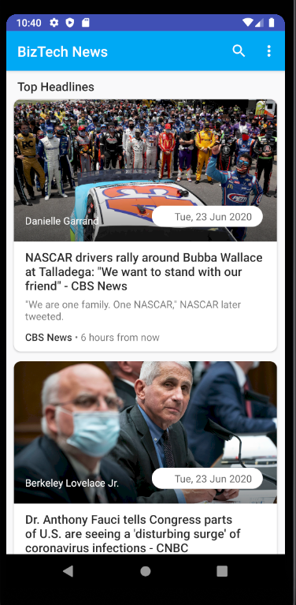

# BizTech_News
A News Aggregator App that uses JSON API for live news and blog articles from the media.

## Screenshots

## Description
- Built on Android Studio 3.
- [News API](https://newsapi.org/) for JSON.
- [Retrofit 2](https://square.github.io/retrofit/) as HTTP Client.
- [Glide](https://bumptech.github.io/glide/doc/generatedapi.html) for the Image Network.
- [Material Design](https://developer.android.com/distribute/best-practices/develop/use-material-design).

# Getting Started
## Prerequisites
- Android

# Installation
TODO apk

## TODO
- Aggregate feed from multiple APIs

## Credits
- [Haerul Muttaqin](https://www.youtube.com/watch?v=9oNZAzIhL7s&list=PLT3-dzFEBix16zontJjPJPeYUWtE_HREq)
